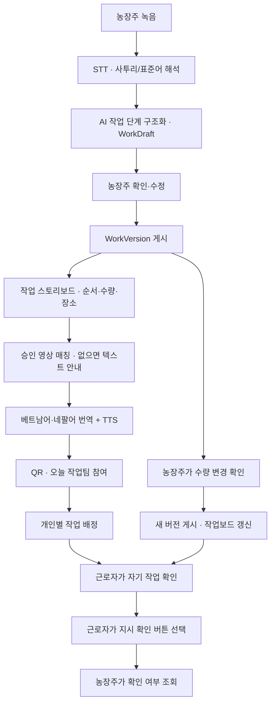
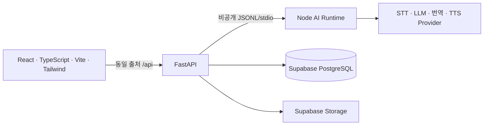

<p align="center">
  
</p>

<h1 align="center">밭머리 · Batmeori</h1>
<p align="center"><strong>말 한마디면, 일이 통합니다.</strong><br>농사의 시작은 소통입니다.</p>
<p align="center">
  <a href="https://batmeori.vercel.app">서비스 둘러보기</a> ·
  <a href="https://batmeori.vercel.app/start">작업 시작하기</a> ·
  <a href="docs/PRODUCT_SPEC.md">제품 명세</a> ·
  <a href="evals/results/2026-09-04-full-workflow-e2e.md">통합 테스트 결과</a>
</p>
<p align="center">
  
</p>

**밭머리**는 농장주의 전라도 사투리·표준어 작업 지시를 **근로자가 자기 언어로 확인하는 오늘의 작업**으로 바꾸는 현장 커뮤니케이션 서비스입니다. 음성을 작업 순서·수량·장소로 정리하고, 농장주가 확인한 내용을 베트남어와 네팔어의 글·음성·작업 영상으로 전달합니다.

2026 전남광주 청년(YOUTH) AI 솔버톤 참여 프로젝트입니다. 현재 P0는 **양파·딸기, 베트남어·네팔어, 수량 변경**에 집중합니다.

## 현장에서 말한 지시가, 각자의 작업으로

농장주는 같은 설명을 여러 번 반복하고, 근로자는 낯선 언어로 장소와 수량을 알아들어야 합니다. 작업 도중 지시가 바뀌면 누가 이전 내용을 보고 있는지도 확인하기 어렵습니다.

밭머리는 **농장주의 확인부터 근로자의 지시 확인까지** 연결합니다.

| 현장의 어려움 | 밭머리의 기능 |
|---|---|
| 사투리 안에 작업·수량·장소가 섞여 있다 | 음성을 전사하고 작업 단계로 구조화합니다. 불확실한 내용은 농장주가 확인합니다. |
| 사람마다 이해하는 언어가 다르다 | 베트남어·네팔어 작업 안내와 TTS를 준비합니다. |
| 말이나 글만으로 작업을 설명하기 어렵다 | 승인된 작업 영상을 매칭하고, 영상이 없으면 글·음성으로 안내합니다. |
| 근로자마다 맡은 작업이 다르다 | 오늘 작업팀 QR로 참여하고, 농장주가 개인별로 하나 이상의 작업을 배정합니다. |
| 수량이 바뀌었는데 이전 지시를 보고 있다 | 확인된 변경을 새 버전으로 게시하고, 열린 작업보드를 갱신합니다. |
| 전달한 지시를 확인했는지 알기 어렵다 | 근로자가 직접 확인 버튼을 누르면 농장주에게 확인 상태를 표시합니다. |

<table>
  <tr>
    <td width="38%" align="center">
      
      <br><sub>랜딩 페이지용 화면 목업 · 실제 서비스 화면과 다를 수 있습니다.</sub>
    </td>
    <td valign="middle">
      <h3>복잡한 가입 없이, 작업부터</h3>
      <p><strong>농장주</strong><br>농장 코드나 계정을 만들지 않고 작업을 입력합니다. 첫 작업을 확정하면 오늘 작업팀의 관리 PIN과 참가 QR이 발급됩니다.</p>
      <p><strong>근로자</strong><br>QR을 열고 별명과 언어만 고릅니다. 배정된 작업을 자기 언어로 보고 듣고, 직접 지시 확인을 남깁니다.</p>
      <p><strong>팀 단위 24시간 관리</strong><br>PIN은 작업마다 바뀌지 않습니다. 같은 팀에 작업을 추가하거나 수량을 바꿔도 PIN·QR·만료 시각은 유지됩니다.</p>
    </td>
  </tr>
</table>

## 녹음부터 확인까지



농장주 확인 전에는 초안(`WorkDraft`)입니다. 확인 시 작업(`WorkSession`)과 최초 버전이 게시되며, 번역·음성·영상 정보도 같은 버전에 연결됩니다. 수량 변경은 미리보기와 농장주 확인을 거쳐 새 버전으로 게시됩니다. 이전 버전은 보존하고, 근로자는 최신 지시를 다시 확인합니다.

위 도식은 사용자 흐름입니다. 내부적으로는 두 언어의 안내 패키지를 준비·검증한 뒤 게시 트랜잭션에서 버전과 함께 저장합니다. TTS 생성에 실패하면 글 안내를 유지합니다.

### 세 가지 전달 방식

| 방식 | 사용 상황 |
|---|---|
| **현장에서 함께 보기** | 농장주 휴대폰에서 근로자 언어를 골라 같이 보고 듣습니다. |
| **언어별 원격 링크** | 로그인 없는 24시간 익명 링크로 최신 작업을 확인합니다. |
| **오늘 작업팀 QR** | 근로자가 팀에 참여하고, 개인별 배정과 지시 확인 상태를 관리합니다. |

오늘 작업팀은 **첫 작업 확정부터 정확히 24시간** 유효합니다. 다른 기기에서 농장주 관리 화면으로 돌아올 때는 관리 링크와 PIN을 사용합니다. 관리 PIN은 근로자의 참가 QR과 별개입니다.

근로자의 **지시 확인은 작업 완료 보고가 아닙니다.** 새 배정·수량 변경 알림은 열린 화면의 주기적 조회와 화면 복귀 시 갱신으로 제공합니다. 브라우저를 닫은 상태의 OS 푸시는 제공하지 않습니다.

## AI는 추측하지 않는다. 결정은 농장주가 한다.

- **모르는 값은 그대로 남깁니다.** 누락된 수량·장소를 임의로 채우지 않습니다.
- **현장 지시어만으로 막지 않습니다.** `저쪽 밭`, `저짝`, `거기`는 원문을 보존하고 밭 번호를 추론하지 않습니다. 실행 가능한 저위험 작업은 농장주가 현장 안내를 선택해 전달할 수 있습니다.
- **위험한 불확실성은 확인이 필요합니다.** 안전 모호함, HIGH/UNKNOWN 위험, 잘못된 구조, 실행 단계가 없는 지시는 게시하지 않습니다.
- **영상은 AI가 사전 생성하고 사람이 검수한 자산입니다.** `APPROVED`이면서 `LOW`인 영상만 매칭합니다. 양파 운반은 영상 없이 텍스트·TTS로 안내합니다.
- **번역 출처를 구분합니다.** 검수된 공식 가이드 번역과 AI 번역을 구분하며, 미검증 자료를 공식으로 표시하지 않습니다.

## 현재 지원 범위

| 구분 | P0 지원 |
|---|---|
| 양파 | 수확 · 손질 · 분류 · 운반 |
| 딸기 | 수확 · 분류 · 검수 · 포장 |
| 근로자 언어 | 베트남어(`vi`) · 네팔어(`ne`) |
| 게시 후 변경 | 농장주가 확인한 수량 변경 |
| 작업팀 | 24시간 임시 참여 · 개인별 복수 작업 배정 · 버전별 지시 확인 |

한 지시에 양파와 딸기 작업을 섞으면 작물별 분리를 요청합니다. 한 팀에 별도의 양파·딸기 작업을 배정할 수 있습니다. 영구 근로자 계정, 전화번호·SMS, 다른 작물·언어, 오프라인 캐시는 현재 범위에 포함하지 않습니다.

## 구현 구조



| 구성 | 책임 |
|---|---|
| **Frontend · Vercel** | 녹음, 농장주 확인, 스토리보드, QR 참여, 개인별 작업·확인 표시 |
| **Backend · Render** | 팀 접근 권한, API, 게시 검증, 버전 저장, 배정·확인 기록 |
| **Node AI Runtime** | STT, 사투리 참고자료 검색, 작업 구조화, 번역, 영상 매칭, TTS |
| **Supabase** | 작업·버전·임시 팀 데이터, 검수 자산, TTS 음성 저장 |

AI 공급자·모델 설정은 서버 환경변수에서 선택합니다. 작업 버전과 두 언어 안내는 원자적으로 저장하며, 수량 변경 실패 시 불완전한 새 버전을 게시하지 않습니다. 자세한 경계는 [아키텍처](docs/ARCHITECTURE.md)에서 확인할 수 있습니다.

## 검증 기록

**2026-09-04 통합 검증 기록**입니다. 현재 브랜치의 실시간 CI 상태를 의미하지 않습니다.

| 검증 | 결과 | 확인한 내용 |
|---|---|---|
| 운영 서비스 E2E | **9/9 통과** | 녹음 업로드, 실제 AI, 농장주 수정·게시, QR 해독, 개인 배정·확인, 새 버전 전파 |
| 로컬 브라우저 E2E | **53/53 통과** | 당시 작업 트리 기준 농장주·근로자 흐름, 양파·딸기 화면, 최신 작업 갱신 |
| 실제 STT·구조화 스모크 | **3/3 통과** | 기존 합성 음성의 수확·운반, 수량 수정, 현장 지시어 |

운영 E2E는 합성 WAV를 마이크 입력으로 사용하고 실제 STT·LLM·DB·영상·TTS를 호출했습니다. 주 시나리오는 양파 수확·운반이며, **실물 휴대폰, 실제 화자의 사투리 정확도, 원어민 번역 품질 검수를 대체하지 않습니다.** 사투리 전체 평가가 통과했다는 의미도 아닙니다.

[통합 E2E 상세 결과](evals/results/2026-09-04-full-workflow-e2e.md) · [원본 단계별 결과](evals/results/full-workflow-20260904/results.json) · [사투리 평가 기록](evals/results/2026-09-04-dialect-resume-review.md) · [평가 기준](docs/EVALS.md)

## 로컬 실행

Node.js·pnpm·Python 환경이 필요합니다. 명령 예시는 PowerShell 기준입니다.

### UI 데모

```powershell
pnpm install
$env:VITE_USE_MOCK_API = 'true'
pnpm dev --host 127.0.0.1
```

`http://127.0.0.1:5173/start`에서 시작합니다. 이 모드는 고정 데모 데이터로 화면을 확인하며 실제 AI를 호출하지 않습니다.

### 실제 API 연결

먼저 [백엔드 안내](backend/README.md), [루트 환경변수 예시](.env.example), [서버 환경변수 예시](backend/.env.example)를 확인합니다. Supabase 스키마·자산과 서버 전용 AI 키 설정이 필요합니다.

```powershell
# 저장소 루트에서 실행. 기존 .env가 있다면 내용을 확인해 필요한 값만 수정합니다.
python -m venv backend/.venv
backend/.venv/Scripts/python.exe -m pip install -r backend/requirements.txt
# backend/.env.example을 참고해 backend/.env 설정 후 실행
backend/.venv/Scripts/python.exe -m uvicorn app.main:app --app-dir backend --host 127.0.0.1 --port 8000 --reload
```

루트 `.env`의 `VITE_API_BASE_URL`은 비우고 `API_UPSTREAM_ORIGIN=http://127.0.0.1:8000`으로 둡니다. 서버의 `FRONTEND_ORIGINS`, `PUBLIC_WEB_BASE_URL`, `PUBLIC_API_BASE_URL`은 모두 `http://127.0.0.1:5173`으로 설정합니다. 별도 터미널에서 mock을 끄고 실행합니다.

```powershell
$env:VITE_USE_MOCK_API = 'false'
pnpm dev --host 127.0.0.1
```

Vercel 배포에서는 `API_UPSTREAM_ORIGIN`에 Render HTTPS 주소를 사용하고, 위 세 서버 공개 주소 설정을 Vercel 주소로 맞춥니다. 비밀 키는 `VITE_*` 환경변수나 저장소에 넣지 않습니다.

### 테스트

```powershell
pnpm test
pnpm run check:contracts
pnpm exec playwright test tests/webapp
pnpm build
```

실제 서비스 통합 검증은 유료 AI 호출과 테스트용 임시 팀 생성을 포함합니다.

```powershell
$env:LIVE_E2E = '1'
$env:LIVE_FRONTEND_ORIGIN = 'https://batmeori.vercel.app'
pnpm run test:live:workflow
```

## 저장소와 문서

| 경로 | 내용 |
|---|---|
| [`src/`](src/) | 랜딩 페이지와 농장주·근로자 웹앱 |
| [`ai/`](ai/) | AI 런타임, 프롬프트, 사투리 참고자료, 런타임 테스트 |
| [`backend/`](backend/) | FastAPI, 저장·인증·배정 서비스, API 테스트 |
| [`supabase/`](supabase/) | 데이터베이스 마이그레이션 |
| [`assets/`](assets/) · [`public/images/`](public/images/) | 검수 자산 목록과 서비스 이미지 |
| [`evals/`](evals/) · [`tests/webapp/`](tests/webapp/) | 평가 입력·결과와 브라우저 E2E |

[제품 명세](docs/PRODUCT_SPEC.md) · [도메인 용어](CONTEXT.md) · [아키텍처](docs/ARCHITECTURE.md) · [OpenAPI](docs/openapi.yaml) · [AI 계약](docs/AI_CONTRACTS.md) · [데이터 모델](docs/DATA_MODEL.md) · [안전 정책](docs/SAFETY_POLICY.md) · [실패 모드](docs/FAILURE_MODES.md)

## 팀

| 이름 | 역할 | 담당 |
|---|---|---|
| 김서영 | Frontend | React 화면, 농장주·근로자 흐름, 다국어 UI, QR 경험 |
| 한창수 | Backend | FastAPI, Supabase, 접근 권한, 버전 트랜잭션, 전달 API |
| 정연석 | Logic | 도메인 로직, Node AI 런타임, 작업 분류, 번역·TTS·영상 계약, 안전·평가 기준 |
