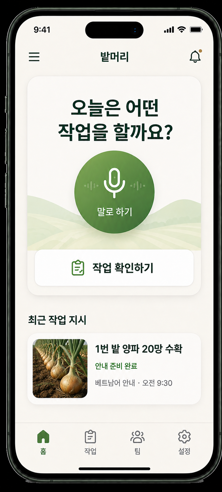
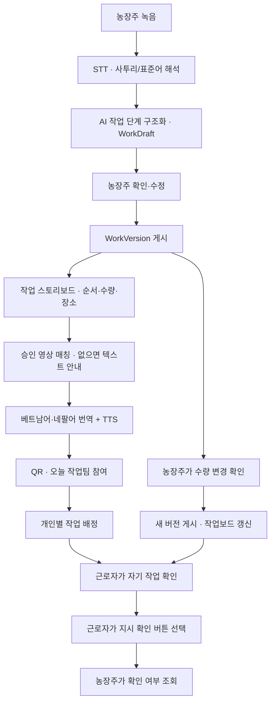
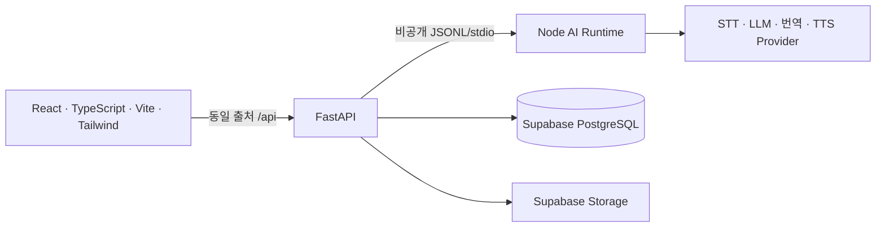

<p align="center">
  
</p>

<h1 align="center">밭머리 · Batmeori</h1>
<p align="center"><strong>말 한마디면, 일이 통합니다.</strong><br>농사의 시작은 소통입니다.</p>
<p align="center">
  <a href="https://batmeori.vercel.app">서비스 둘러보기</a> ·
  <a href="https://batmeori.vercel.app/start">작업 시작하기</a> ·
  <a href="docs/PRODUCT_SPEC.md">제품 명세</a> ·
  <a href="evals/results/2026-09-04-full-workflow-e2e.md">통합 테스트 결과</a>
</p>
<p align="center">
  
</p>

**밭머리**는 농장주의 전라도 사투리·표준어 작업 지시를 **근로자가 자기 언어로 확인하는 오늘의 작업**으로 바꾸는 현장 커뮤니케이션 서비스입니다. 음성을 작업 순서·수량·장소로 정리하고, 농장주가 확인한 내용을 베트남어와 네팔어의 글·음성·작업 영상으로 전달합니다.

2026 전남광주 청년(YOUTH) AI 솔버톤 참여 프로젝트입니다. 현재 P0는 **양파·딸기, 베트남어·네팔어, 수량 변경**에 집중합니다.

## 왜 이 문제인가

### 대상 사용자

- **농장주:** 외국인 근로자에게 당일 농작업을 직접 전달하는 농가
- **근로자:** 한국어 작업 지시 이해가 어려운 외국인 계절근로자

### 현황과 현장 문제

- 농림축산식품부·관계 부처는 2026년 외국인 계절근로자 **10만 9,100명**을 전국 142개 지자체에 배정했습니다. 농업 계절근로자 고용주도 2만 7,190명입니다. [정부 보도자료](https://mafra.go.kr/bbs/home/792/592898/download.do)
- 전남도는 2024년 상반기 대비 약 78% 증가한 **4,055명**의 계절근로자가 전남에 입국해 농업 인력난 완화에 기여했다고 발표했습니다. [전남도 사례](https://www.jeonnam.go.kr/T1840601/boardView.do?boardId=T1840601&displayHeader=&infoReturn=&menuId=jeonnam0509040400&pageIndex=1&searchEnDate=&searchStDate=&searchText=&searchType=&seq=28)
- 현장에서는 구두 지시에 작업·순서·수량·장소가 한 문장에 섞이고, 지역어와 농작업 표현까지 더해집니다. 작업 중 수량이 바뀌면 이전 지시와 최신 지시가 섞일 수 있습니다.

## 현장에서 말한 지시가, 각자의 작업으로

농장주는 같은 설명을 여러 번 반복하고, 근로자는 낯선 언어로 장소와 수량을 알아들어야 합니다. 작업 도중 지시가 바뀌면 누가 이전 내용을 보고 있는지도 확인하기 어렵습니다.

밭머리는 **농장주의 확인부터 근로자의 지시 확인까지** 연결합니다.

| 현장의 어려움 | 밭머리의 기능 |
|---|---|
| 사투리 안에 작업·수량·장소가 섞여 있다 | 음성을 전사하고 작업 단계로 구조화합니다. 불확실한 내용은 농장주가 확인합니다. |
| 사람마다 이해하는 언어가 다르다 | 베트남어·네팔어 작업 안내와 TTS를 준비합니다. |
| 말이나 글만으로 작업을 설명하기 어렵다 | 승인된 작업 영상을 매칭하고, 영상이 없으면 글·음성으로 안내합니다. |
| 근로자마다 맡은 작업이 다르다 | 오늘 작업팀 QR로 참여하고, 농장주가 개인별로 하나 이상의 작업을 배정합니다. |
| 수량이 바뀌었는데 이전 지시를 보고 있다 | 확인된 변경을 새 버전으로 게시하고, 열린 작업보드를 갱신합니다. |
| 전달한 지시를 확인했는지 알기 어렵다 | 근로자가 직접 확인 버튼을 누르면 농장주에게 확인 상태를 표시합니다. |

<table>
  <tr>
    <td width="38%" align="center">
      
      <br><sub>랜딩 페이지용 화면 목업 · 실제 서비스 화면과 다를 수 있습니다.</sub>
    </td>
    <td valign="middle">
      <h3>복잡한 가입 없이, 작업부터</h3>
      <p><strong>농장주</strong><br>농장 코드나 계정을 만들지 않고 작업을 입력합니다. 첫 작업을 확정하면 오늘 작업팀의 관리 PIN과 참가 QR이 발급됩니다.</p>
      <p><strong>근로자</strong><br>QR을 열고 별명과 언어만 고릅니다. 배정된 작업을 자기 언어로 보고 듣고, 직접 지시 확인을 남깁니다.</p>
      <p><strong>팀 단위 24시간 관리</strong><br>PIN은 작업마다 바뀌지 않습니다. 같은 팀에 작업을 추가하거나 수량을 바꿔도 PIN·QR·만료 시각은 유지됩니다.</p>
    </td>
  </tr>
</table>

## 녹음부터 확인까지



농장주 확인 전에는 초안(`WorkDraft`)입니다. 확인 시 작업(`WorkSession`)과 최초 버전이 게시되며, 번역·음성·영상 정보도 같은 버전에 연결됩니다. 수량 변경은 미리보기와 농장주 확인을 거쳐 새 버전으로 게시됩니다. 이전 버전은 보존하고, 근로자는 최신 지시를 다시 확인합니다.

위 도식은 사용자 흐름입니다. 내부적으로는 두 언어의 안내 패키지를 준비·검증한 뒤 게시 트랜잭션에서 버전과 함께 저장합니다. TTS 생성에 실패하면 글 안내를 유지합니다.

### 세 가지 전달 방식

| 방식 | 사용 상황 |
|---|---|
| **현장에서 함께 보기** | 농장주 휴대폰에서 근로자 언어를 골라 같이 보고 듣습니다. |
| **언어별 원격 링크** | 로그인 없는 24시간 익명 링크로 최신 작업을 확인합니다. |
| **오늘 작업팀 QR** | 근로자가 팀에 참여하고, 개인별 배정과 지시 확인 상태를 관리합니다. |

오늘 작업팀은 **첫 작업 확정부터 정확히 24시간** 유효합니다. 다른 기기에서 농장주 관리 화면으로 돌아올 때는 관리 링크와 PIN을 사용합니다. 관리 PIN은 근로자의 참가 QR과 별개입니다.

근로자의 **지시 확인은 작업 완료 보고가 아닙니다.** 새 배정·수량 변경 알림은 열린 화면의 주기적 조회와 화면 복귀 시 갱신으로 제공합니다. 브라우저를 닫은 상태의 OS 푸시는 제공하지 않습니다.

## 왜 AI가 필요한가

**밭머리에서 AI의 핵심 역할은 번역이 아니라 비정형 현장 발화를 실행 가능한 작업 구조로 변환하는 것입니다.**

| 단순 STT+번역 | 밭머리 |
|---|---|
| 문장 전체를 번역한다 | 작업·순서·수량·장소를 구조화한다 |
| 모호한 값도 번역될 수 있다 | `unknown`/`null`을 보존하고 농장주가 확인한다 |
| 지시 변경을 추적하기 어렵다 | `WorkVersion`으로 최신 지시를 관리한다 |
| 영상과 작업을 연결하기 어렵다 | `task_code` 기반의 검수 영상만 매칭한다 |
| 번역·TTS 실패 처리 기준이 불명확하다 | 영상·TTS 실패 시 텍스트 fallback을 유지한다 |

## AI는 추측하지 않는다. 결정은 농장주가 한다.

- **모르는 값은 그대로 남깁니다.** 누락된 수량·장소를 임의로 채우지 않습니다.
- **현장 지시어만으로 막지 않습니다.** `저쪽 밭`, `저짝`, `거기`는 원문을 보존하고 밭 번호를 추론하지 않습니다. 실행 가능한 저위험 작업은 농장주가 현장 안내를 선택해 전달할 수 있습니다.
- **위험한 불확실성은 확인이 필요합니다.** 안전 모호함, HIGH/UNKNOWN 위험, 잘못된 구조, 실행 단계가 없는 지시는 게시하지 않습니다.
- **영상은 AI가 사전 생성하고 사람이 검수한 자산입니다.** `APPROVED`이면서 `LOW`인 영상만 매칭합니다. 양파 운반은 영상 없이 텍스트·TTS로 안내합니다.
- **정부 가이드 번역을 과장하지 않습니다.** 정부 가이드 데이터는 `source`·`page`·`license`·`verified`를 보존하는 구조와 게시 gate를 구현했습니다. 저장소의 [수집 CSV](data/government_guide/)는 현재 사람이 원문 PDF와 대조해 채울 빈 양식입니다. 검수되지 않은 항목은 공식 번역으로 사용하지 않고 일반 작업 안내는 AI 번역 fallback을 사용합니다. 안전 문구는 검수된 출처가 없으면 자동 게시하지 않습니다.

## 현재 지원 범위

| 구분 | P0 지원 |
|---|---|
| 양파 | 수확 · 손질 · 분류 · 운반 |
| 딸기 | 수확 · 분류 · 검수 · 포장 |
| 근로자 언어 | 베트남어(`vi`) · 네팔어(`ne`) |
| 게시 후 변경 | 농장주가 확인한 수량 변경 |
| 작업팀 | 24시간 임시 참여 · 개인별 복수 작업 배정 · 버전별 지시 확인 |

한 지시에 양파와 딸기 작업을 섞으면 작물별 분리를 요청합니다. 한 팀에 별도의 양파·딸기 작업을 배정할 수 있습니다. 영구 근로자 계정, 전화번호·SMS, 다른 작물·언어, 오프라인 캐시는 현재 범위에 포함하지 않습니다.

## 최종 기술 선택

| 선택 | 이유와 한계 |
|---|---|
| LLM 구조화 | 사투리·복합 작업을 고정 규칙만으로 안전하게 처리하기 어렵습니다. |
| 구조 정규화 | 문장 번역 전에 단계·수량·장소·모호함을 명시해 농장주 확인 대상으로 만듭니다. |
| 사투리 참고자료 | 효과가 추가로 입증되지는 않아, 원문 치환 없이 보조 문맥으로만 제한했습니다. |
| Human-in-the-loop | 수량·장소·안전의 과잉 추론을 막고, 최종 결정은 농장주가 합니다. |
| WorkVersion | 변경된 작업과 이전 지시가 섞이지 않도록 최신 게시본을 관리합니다. |
| 사전 생성·사람 검수 영상 | 실시간 영상 생성의 안전·일관성 문제를 피하고, 승인 자산만 사용합니다. |

## 재현 가능한 실험과 개선 결과

### 실패 재현부터 반복 검증까지

**실패를 재현하고, 원인을 STT·구조화·화면으로 나눈 뒤, 수정한 규칙을 기존 입력과 새로운 표현으로 다시 검증했습니다.** 아래는 원본 결과가 보존된 2026-09-04 실험입니다.

| 평가 목적 | 결과 | 해석 |
|---|---|---|
| 사전·프롬프트·백엔드 통합 개선 전후 | 기존 진단 43/50 → 47/50 | 여러 변경의 결합 효과; 사전만의 효과로 단정하지 않음 |
| 사전 문맥만 켜고 끈 최종 비교 | on 69/69 · off 69/69 | 동일 23건 × 3회에서 사전의 추가 이득 미입증 |
| 사전에 없는 표현 일반화 | 양쪽 모두 27/27 | 위 평가의 부분집합 9건 × 3회; 새 표현을 사전에 추가하지 않음 |
| STT를 포함한 사투리 음성 | 12/14 | 7건 × 2회; `캐서` 동작 누락 2회 잔존 |
| 운영 서비스 전체 흐름 | 9/9 | 녹음·AI·게시·배정·확인·수량 변경 전파 검증 |

<details>
<summary>평가 방법, 구체적인 실패·수정 사례, 원본 결과 보기</summary>

### 1. 화면 테스트와 AI 의미 평가를 분리했습니다

초기 mock 브라우저 테스트는 **32/32 통과**했지만, 실제 AI 진단에서는 **50건 중 7건이 필드 검사에 실패**했습니다. mock은 음성과 무관하게 고정 초안을 반환하므로 STT의 동작 누락이나 잘못된 수량을 발견할 수 없었습니다.

| 검증 층 | 방법 | 검사 대상 |
|---|---|---|
| 단위·계약 테스트 | Node·Python 테스트와 schema·게시 정책 검사 | 출력 형식, 작물별 코드, 위험 작업 차단, 버전·권한 |
| 실제 LLM 텍스트 평가 | 작성한 지시와 기대 필드를 실제 Node AI 경로·백엔드 검증기에 입력 | 작업 누락·순서, 수량·단위, 장소 보존, 필요한 질문과 불필요한 차단 |
| STT 포함 평가 | 원문·해시가 기록된 합성 WAV를 실제 STT와 구조화에 입력 | 전사 오류와 구조화 오류를 분리해 추적 |
| 운영 통합 E2E | 독립된 농장주·근로자 브라우저에서 실제 API·DB·미디어 사용 | 녹음부터 배정·지시 확인·새 버전 전파까지 |

평가에서는 유효한 JSON이라고 정답으로 세지 않습니다. 예를 들어 `{value:20, unit:"망캐"}`는 형식을 통과해도 단위와 동작을 잘못 나눈 결과입니다. 원문 입력, 기대 필드, 원시 출력, 실패 이유, 모델·프롬프트·사전 해시를 함께 기록했습니다. [최초 실패 분석](evals/results/2026-09-04-dialect-review.md)

### 2. 실패 사례를 일반 규칙으로 수정했습니다

| 재현한 문제 | 원인과 개선 | 재검증 결과·한계 |
|---|---|---|
| `스무 망캐갖고`에서 단위가 `망캐`가 되고 수확 누락 | 수량·용기 단위와 인접 동사를 분리하고, 원문에 있는 모든 동작과 순서를 보존하도록 구조화 지침 보강 | 단위·동작 경계와 복합 작업을 통제 텍스트 회귀에 포함 |
| `수량은 정하지 않았어`인데 질문 없이 READY | 단순 수량 생략과 명시적 미정·유보를 구분하고, 후자는 unknown과 수량 확인 질문을 함께 보존 | 새 표현·반복 평가에서 질문과 blocking 여부 확인 |
| 양파·딸기 혼합 지시에서 schema 오류 | 서로 다른 작물 코드를 한 작업에 섞지 않고 작물별 분리를 요청하도록 수정 | 정순·역순·부정문을 포함해 평가; 오류 대신 보완이 필요한 초안 반환 |
| `저짝 밭`에서 경고 누락 또는 추가 입력 강제 | 현장 지시어와 실제 장소 충돌을 구분하고, 원문·null 정규 위치 보존 및 현장 안내 선택 제공 | 지시어만으로 차단하지 않되 실제 충돌은 차단하는 회귀 검증 |
| 낮은 신뢰도의 한국어 STT 토큰인데 재검증 생략 | UTF-8 분할 토큰의 대체문자 `�`가 문자 필터에서 빠지는 버그 수정; bytes도 검사 | 실패하는 단위 테스트로 재현 후 통과. 동작 전사 오류 자체가 모두 해결된 것은 아님 |
| 다른 탭에서 수량 변경 후 농장주 화면 3곳이 이전 값 표시 | 현재 작업·홈 목록의 갱신 추가, 팀 배정 목록도 확인 기록과 함께 갱신 | 수정 전 실패한 회귀 3건 통과 후 운영 E2E로 최신 수량·재확인 검증 |

특정 테스트 문장을 치환하거나 **표현을 task_code로 강제 매핑하지 않았습니다.** 양파 운반도 작업 분류와 영상 유무를 분리해 동작은 유지하고 텍스트·TTS로 전달합니다. [수정 근거와 회귀 기록](evals/results/2026-09-04-dialect-resume-review.md)

### 3. 사전 도입 전후와 사전 자체의 효과를 따로 비교했습니다

사투리 참고자료는 **16개 의미 묶음·96개 표현**으로 구성하고, 관련 항목을 최대 8개 골라 기존 LLM 요청에 제공합니다. 원문을 강제로 바꾸거나 검색용 추가 LLM 호출을 넣지 않았습니다. 사전·프롬프트·백엔드 검증을 함께 개선한 첫 비교에서는 다음 변화가 관찰됐습니다.

| 고정 입력 진단 | 개선 전 | 첫 개선 후보 |
|---|---:|---:|
| 기존 텍스트 47건 + 합성 STT smoke 3건 | 43/50 | 47/50 |
| 별도 합성 사투리 음성 7건 | 4/7 | 6/7 |

이는 **지정 필드 검사 통과 수**이며 전체 의미 정확도가 아닙니다. 첫 행은 텍스트·음성을 합친 당시 진단 집계로 정식 출시 지표와 분리합니다. 프롬프트·사전·백엔드가 함께 바뀌었으므로 이 상승을 사전만의 효과로 설명할 수 없습니다. 일부 음성은 검사 필드를 통과해도 장소 손실이 남았습니다. [첫 비교와 채점 한계](evals/results/2026-09-04-dialect-context-review.md)

그래서 최종에는 **같은 모델·프롬프트·입력 23건을 각각 3회**, 사전 문맥만 켜고 끄는 통제 비교를 진행했습니다. 두 군의 재시도 조건도 같게 맞췄습니다.

| 최종 통제 텍스트 평가 | 사전 문맥 사용 | 사전 문맥 미사용 |
|---|---:|---:|
| 전체 23건 × 3회 | **69/69** | **69/69** |
| 그중 사전에 없는 표현 9건 × 3회 | **27/27** | **27/27** |

**이 세트에서는 사전 자체의 추가 성능 이득이 입증되지 않았습니다.** 문맥 사용군만 백엔드 재시도를 하던 초기 비교 도구의 차이도 바로잡아, 최종에는 양쪽 모두 입력당 1회 시도를 적용했습니다. 모델(`gpt-5.6-terra`), 데이터·프롬프트 해시를 고정하고 실행 중 소스 변경이 없음을 확인했습니다. 반복 69회는 서로 다른 지시 69개를 뜻하지 않습니다. [사용군 원본](evals/results/dialect-20260903T211812703551Z/summary.json) · [미사용군 원본](evals/results/dialect-20260903T211919642849Z/summary.json)

### 4. 사전에 없는 표현과 남은 실패도 확인했습니다

`분리해 놓으랑께`, `들여다보랑께`, `잘라 놓으씨요` 등 새 표현 9개는 사전 본문에 없음을 검사했고, 그중 5개 입력은 참고 항목도 매칭되지 않았습니다. 두 군 모두 해당 27회 검사를 통과했습니다. 정답 표현을 사전에 추가한 뒤 일반화 성공으로 세지 않았습니다. 다만 작은 자체 작성 세트의 결과이며, 모든 전라도 표현을 이해한다는 증거는 아닙니다. [사전 미포함 감사](evals/results/2026-09-04-generalization-reference-audit.json)

최종 기존 텍스트는 **47/47**, 합성 사투리 음성은 **7건 × 2회 중 12/14**였습니다. `캐서`가 `해서`로 전사되어 수확 단계가 빠지는 실패가 두 번 모두 남았습니다. 별도 STT smoke도 해당 시점에는 **2/3**으로, `저짝 밭`을 `저작밭`이라는 고유 장소로 받아들인 사례가 있었습니다. [최종 음성 결과](evals/results/dialect-20260903T211842007937Z/summary.json) · [기존 텍스트·smoke 결과](evals/results/dialect-20260903T211858716860Z/summary.json)

전사 프롬프트, 후보 비교 프롬프트, 더 강한 검토 모델도 추가 시험했으나 동작 손실을 일관되게 해결하지 못해 운영 기본값에 채택하지 않았습니다. 이후 운영 통합 검증의 별도 smoke 3/3은 후속 실행 결과이며 앞선 실패를 지우지 않습니다. **STT 품질 출시 기준은 미통과로 남겼고**, 실제 화자·잡음·휴대폰 마이크, 원어민 농업 용어 검수는 다음 검증 과제입니다. [채택하지 않은 STT 실험](evals/results/2026-09-04-stt-resume-diagnostics.json)

</details>

<details>
<summary>평가 재현 방법과 전체 실험 기록</summary>

실제 provider를 호출하므로 비용이 발생합니다. 서버 환경변수 설정 후 저장소 루트에서 실행합니다. 기존 실패 결과는 덮어쓰지 않고 새 실행 디렉터리에 기록합니다.

```powershell
$env:PYTHONIOENCODING = 'utf-8'
backend/.venv/Scripts/python.exe backend/evaluate_dialect.py evals/dialect-controlled-20260904.jsonl --repeat 3
backend/.venv/Scripts/python.exe backend/evaluate_dialect.py evals/dialect-controlled-20260904.jsonl --repeat 3 --without-dialect
```

과거 점수는 당시 source hash에 대한 기록입니다. 현재 소스로 재실행한 결과는 별도 실험으로 비교합니다. 직접 번역 대 구조화 파이프라인 비교, 지연시간 P50/P95·비용 비교처럼 계획만 있는 지표는 성과로 주장하지 않습니다.

[평가 데이터셋](evals/dialect-controlled-20260904.jsonl) · [E-001~E-009 실험 로그](docs/EXPERIMENT_LOG.md) · [평가 기준과 출시 조건](docs/EVALS.md)

</details>

## 구현 구조



| 구성 | 책임 |
|---|---|
| **Frontend · Vercel** | 녹음, 농장주 확인, 스토리보드, QR 참여, 개인별 작업·확인 표시 |
| **Backend · Render** | 팀 접근 권한, API, 게시 검증, 버전 저장, 배정·확인 기록 |
| **Node AI Runtime** | STT, 사투리 참고자료 검색, 작업 구조화, 번역, 영상 매칭, TTS |
| **Supabase** | 작업·버전·임시 팀 데이터, 검수 자산, TTS 음성 저장 |

AI 공급자·모델 설정은 서버 환경변수에서 선택합니다. 작업 버전과 두 언어 안내는 원자적으로 저장하며, 수량 변경 실패 시 불완전한 새 버전을 게시하지 않습니다. 자세한 경계는 [아키텍처](docs/ARCHITECTURE.md)에서 확인할 수 있습니다.

## 데이터 출처·이용 조건·fallback

- **정부 가이드:** [수집 게이트](data/government_guide/README.md)는 원문 PDF를 사람이 대조한 뒤 `source_name`·page·URL·license·`verified`를 채우도록 합니다. 현재 저장소 CSV는 헤더만 있는 빈 양식이며, 검증 전에는 공식 번역으로 게시하지 않습니다.
- **일반 작업 안내:** 검수된 가이드 HIT가 없는 표현은 AI 번역 fallback을 사용합니다. 이는 공식 번역이라고 표시하지 않습니다.
- **안전 문구:** 검수된 가이드 출처가 없으면 자동 게시하지 않습니다. 위험도 HIGH/UNKNOWN, 구조 오류, 실행 단계 없음도 게시를 차단합니다.
- **영상·음성:** 영상은 사전 생성 후 사람이 검수한 `APPROVED`·LOW 위험 자산만 사용합니다. 영상 또는 TTS가 실패하면 텍스트 안내를 유지합니다.

## 검증 기록

**2026-09-04 통합 검증 기록**입니다. 현재 브랜치의 실시간 CI 상태를 의미하지 않습니다.

| 검증 | 결과 | 확인한 내용 |
|---|---|---|
| 운영 서비스 E2E | **9/9 통과** | 녹음 업로드, 실제 AI, 농장주 수정·게시, QR 해독, 개인 배정·확인, 새 버전 전파 |
| 로컬 브라우저 E2E | **53/53 통과** | 당시 작업 트리 기준 농장주·근로자 흐름, 양파·딸기 화면, 최신 작업 갱신 |
| 실제 STT·구조화 스모크 | **3/3 통과** | 기존 합성 음성의 수확·운반, 수량 수정, 현장 지시어 |

운영 E2E는 합성 WAV를 마이크 입력으로 사용하고 실제 STT·LLM·DB·영상·TTS를 호출했습니다. 주 시나리오는 양파 수확·운반이며, **실물 휴대폰, 실제 화자의 사투리 정확도, 원어민 번역 품질 검수를 대체하지 않습니다.** 사투리 전체 평가가 통과했다는 의미도 아닙니다.

[통합 E2E 상세 결과](evals/results/2026-09-04-full-workflow-e2e.md) · [원본 단계별 결과](evals/results/full-workflow-20260904/results.json) · [사투리 평가 기록](evals/results/2026-09-04-dialect-resume-review.md) · [평가 기준](docs/EVALS.md)

## 로컬 실행

Node.js·pnpm·Python 환경이 필요합니다. 명령 예시는 PowerShell 기준입니다.

### UI 데모

```powershell
pnpm install
$env:VITE_USE_MOCK_API = 'true'
pnpm dev --host 127.0.0.1
```

`http://127.0.0.1:5173/start`에서 시작합니다. 이 모드는 고정 데모 데이터로 화면을 확인하며 실제 AI를 호출하지 않습니다.

### 실제 API 연결

먼저 [백엔드 안내](backend/README.md), [루트 환경변수 예시](.env.example), [서버 환경변수 예시](backend/.env.example)를 확인합니다. Supabase 스키마·자산과 서버 전용 AI 키 설정이 필요합니다.

```powershell
# 저장소 루트에서 실행. 기존 .env가 있다면 내용을 확인해 필요한 값만 수정합니다.
python -m venv backend/.venv
backend/.venv/Scripts/python.exe -m pip install -r backend/requirements.txt
# backend/.env.example을 참고해 backend/.env 설정 후 실행
backend/.venv/Scripts/python.exe -m uvicorn app.main:app --app-dir backend --host 127.0.0.1 --port 8000 --reload
```

루트 `.env`의 `VITE_API_BASE_URL`은 비우고 `API_UPSTREAM_ORIGIN=http://127.0.0.1:8000`으로 둡니다. 서버의 `FRONTEND_ORIGINS`, `PUBLIC_WEB_BASE_URL`, `PUBLIC_API_BASE_URL`은 모두 `http://127.0.0.1:5173`으로 설정합니다. 별도 터미널에서 mock을 끄고 실행합니다.

```powershell
$env:VITE_USE_MOCK_API = 'false'
pnpm dev --host 127.0.0.1
```

Vercel 배포에서는 `API_UPSTREAM_ORIGIN`에 Render HTTPS 주소를 사용하고, 위 세 서버 공개 주소 설정을 Vercel 주소로 맞춥니다. 비밀 키는 `VITE_*` 환경변수나 저장소에 넣지 않습니다.

### 테스트

```powershell
pnpm test
pnpm run check:contracts
pnpm exec playwright test tests/webapp
pnpm build
```

실제 서비스 통합 검증은 유료 AI 호출과 테스트용 임시 팀 생성을 포함합니다.

```powershell
$env:LIVE_E2E = '1'
$env:LIVE_FRONTEND_ORIGIN = 'https://batmeori.vercel.app'
pnpm run test:live:workflow
```

## 저장소와 문서

| 경로 | 내용 |
|---|---|
| [`src/`](src/) | 랜딩 페이지와 농장주·근로자 웹앱 |
| [`ai/`](ai/) | AI 런타임, 프롬프트, 사투리 참고자료, 런타임 테스트 |
| [`backend/`](backend/) | FastAPI, 저장·인증·배정 서비스, API 테스트 |
| [`supabase/`](supabase/) | 데이터베이스 마이그레이션 |
| [`assets/`](assets/) · [`public/images/`](public/images/) | 검수 자산 목록과 서비스 이미지 |
| [`evals/`](evals/) · [`tests/webapp/`](tests/webapp/) | 평가 입력·결과와 브라우저 E2E |

[제품 명세](docs/PRODUCT_SPEC.md) · [도메인 용어](CONTEXT.md) · [아키텍처](docs/ARCHITECTURE.md) · [OpenAPI](docs/openapi.yaml) · [AI 계약](docs/AI_CONTRACTS.md) · [데이터 모델](docs/DATA_MODEL.md) · [안전 정책](docs/SAFETY_POLICY.md) · [실패 모드](docs/FAILURE_MODES.md)

## 팀

| 이름 | 역할 | 담당 |
|---|---|---|
| 김서영 | Frontend | React 화면, 농장주·근로자 흐름, 다국어 UI, QR 경험 |
| 한창수 | Backend | FastAPI, Supabase, 접근 권한, 버전 트랜잭션, 전달 API |
| 정연석 | Logic | 도메인 로직, Node AI 런타임, 작업 분류, 번역·TTS·영상 계약, 안전·평가 기준 |

## 도입·확장 방향

P0는 전남 농가의 당일 작업 전달 검증에 집중합니다. 이후 농협·지자체·계절근로자 운영기관 단위 도입을 검증하고, 원어민 검수와 현장 사용성 검증을 마친 뒤 작물·언어 확장을 판단합니다.
