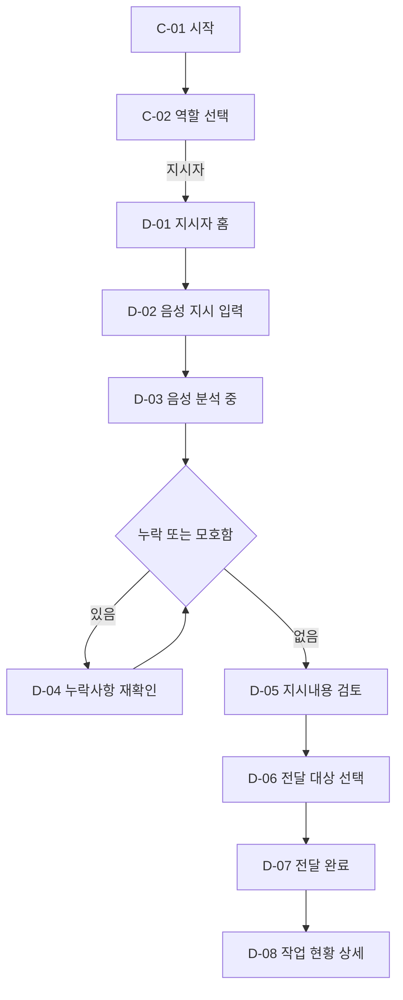
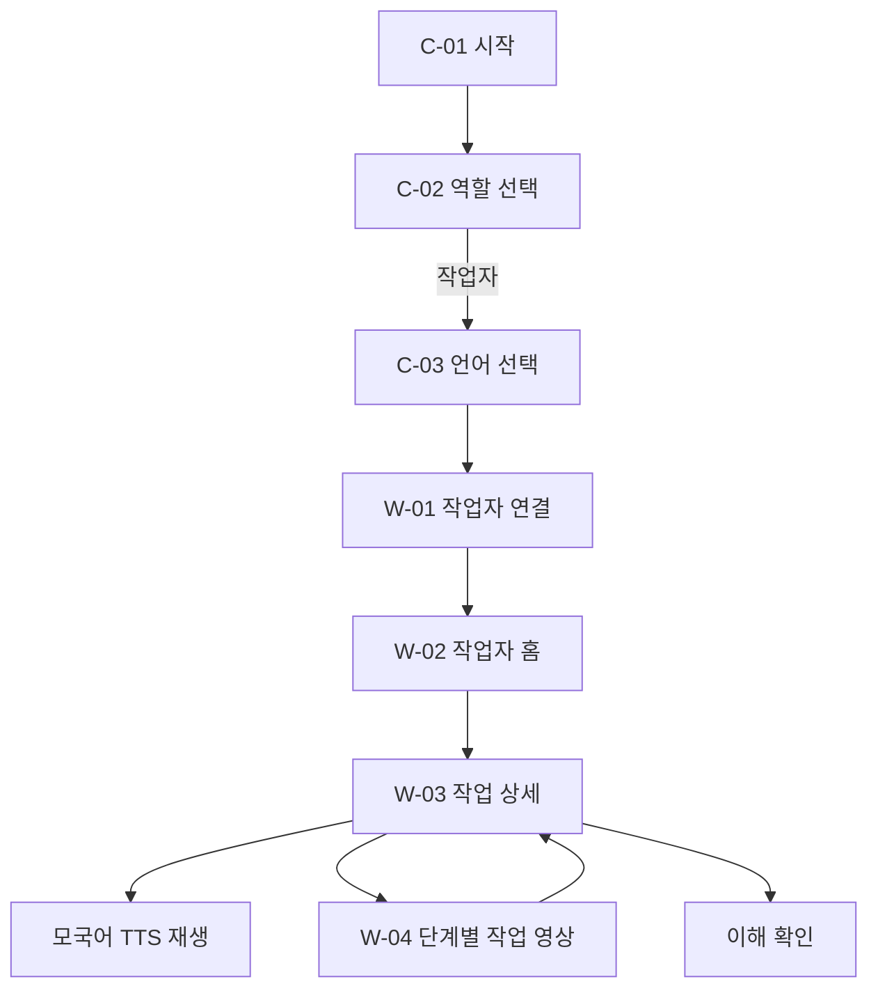
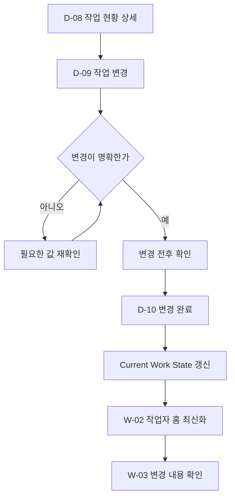
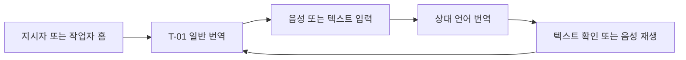

# 농담 화면·기능 명세서

## 1. 문서 개요

이 문서는 전남 양파 작업을 대상으로 하는 다국어 농작업 지시 서비스 **농담**의 모바일 웹 화면, 기능, 화면 간 이동 흐름을 정의한다.

농담은 농장주의 전라도 사투리·한국어 음성 지시를 AI가 실행 가능한 작업명세로 구조화하고, 외국인 작업자에게 모국어 텍스트·음성·작업 영상으로 전달한다.

### 1.1 사용자

| 구분 | 주요 사용자 | 핵심 목적 |
|---|---|---|
| 지시자 | 전라도 지역 농장주·작업반장 | 말로 작업을 지시하고, AI가 정리한 내용을 확인해 전달한다. |
| 작업자 | 베트남·네팔·캄보디아 출신 근로자 | 자신의 언어와 영상으로 최신 작업지시를 이해한다. |

### 1.2 MVP 언어 범위

- P0: 한국어 입력, 베트남어·네팔어 출력
- 확장: 크메르어(캄보디아어)를 동일한 구조로 추가
- 화면 설계 시 언어명이 늘어나도 레이아웃이 깨지지 않아야 한다.

### 1.3 기능 우선순위

| 등급 | 의미 |
|---|---|
| P0 | 해커톤 데모와 서비스 핵심 흐름에 반드시 필요 |
| P0+ | P0 완료 후 우선 구현 |
| P1 | 추가 시간이 있을 때 구현 |

### 1.4 디자인 방향

기본 디자인은 **햇살 작업판**을 사용한다.

- 따뜻하고 쉬운 업무형
- 홈 화면에서 오늘의 작업과 진행 상태를 가장 먼저 표시
- 큰 글자, 명확한 버튼, 쉬운 표현 사용
- 주황 `#EF6A3A`, 크림 `#FFFAF0`, 연두 `#E9F3D5`, 연노랑 `#FFF0C7`, 진한 글자 `#2A2620`을 기본 색상으로 사용
- 색상만으로 상태를 전달하지 않고 아이콘과 문구를 함께 사용
- 현장 사용을 고려해 주요 터치 영역은 최소 44×44px로 제공

---

## 2. 전체 정보 구조

```text
앱 시작
├─ 역할 선택
│  ├─ 지시자로 시작
│  │  └─ 지시자 홈
│  │     ├─ 새 작업 지시
│  │     │  ├─ 음성 입력
│  │     │  ├─ AI 분석
│  │     │  ├─ 누락사항 재확인
│  │     │  ├─ 지시내용 검토
│  │     │  ├─ 전달 대상 선택
│  │     │  └─ 전달 완료
│  │     ├─ 진행 중 작업
│  │     │  ├─ 작업 상세
│  │     │  └─ 작업 변경
│  │     └─ 일반 번역
│  └─ 작업자로 시작
│     ├─ 언어 선택
│     └─ 작업자 홈
│        ├─ 최신 작업 상세
│        │  ├─ 모국어 듣기
│        │  └─ 단계별 영상 보기
│        └─ 질문·일반 번역
└─ 공통
   ├─ 알림
   ├─ 연결 오류
   └─ 설정
```

---

## 3. 공통 화면

## C-01. 시작 화면

**우선순위:** P0

### 목적

서비스 진입점을 제공하고 저장된 사용자 설정에 따라 다음 화면을 결정한다.

### 주요 표시

- 농담 로고
- 핵심 문구: “말을 번역하는 데서 끝내지 않고, 바로 할 수 있는 작업으로.”
- 로딩 상태

### 동작

- 최초 사용자: `C-02 역할 선택`로 이동
- 역할과 언어가 저장된 사용자: 해당 역할의 홈으로 자동 이동
- 초기화 실패: 재시도 버튼 표시

---

## C-02. 역할 선택

**우선순위:** P0

### 목적

사용자가 지시자인지 작업자인지 선택한다.

### 주요 표시

- “어떻게 사용하시나요?” 안내
- `작업을 지시해요` 카드
- `작업을 받아요` 카드
- 역할별 쉬운 설명과 아이콘

### 사용자 동작

- 지시자 선택 → `D-01 지시자 홈`
- 작업자 선택 → `C-03 작업자 언어 선택`

### 예외 처리

- 잘못 선택한 경우 설정에서 역할을 다시 선택할 수 있다.

---

## C-03. 작업자 언어 선택

**우선순위:** P0

### 목적

작업자가 작업지시를 받을 기본 언어를 선택한다.

### 주요 표시

- 언어명은 해당 언어 자체 표기와 한국어를 함께 제공
- Tiếng Việt / 베트남어
- नेपाली / 네팔어
- ភាសាខ្មែរ / 크메르어 — 확장 예정인 경우 비활성 상태 표시
- `이 언어로 시작` 버튼

### 사용자 동작

- 언어 선택
- 선택 언어의 샘플 음성 듣기
- 선택 확정 → `W-01 작업자 연결`

---

## C-04. 알림 목록

**우선순위:** P0+

### 목적

새 작업, 변경된 작업, 위험 질문 등 중요한 변화를 모아 보여준다.

### 알림 유형

- 새 작업지시 도착
- 작업 내용 변경
- 작업 취소
- 작업자의 질문
- 위험·장비 이상 보고

### 사용자 동작

- 알림 선택 → 관련 작업 상세 또는 질문 상세로 이동
- 모두 읽음 처리

---

## C-05. 설정

**우선순위:** P1

### 주요 기능

- 역할 변경
- 기본 언어 변경
- 음성 재생 속도 조절
- 큰 글씨 사용
- 알림 설정
- 서비스 정보 확인

---

## 4. 지시자 화면

## D-01. 지시자 홈

**우선순위:** P0

### 목적

오늘 작업 현황을 확인하고 가장 빠르게 새 작업지시를 시작한다.

### 주요 표시

- 상단 인사말과 농장명 또는 사용자명
- 알림 버튼
- 오늘의 작업 요약
  - 전체 작업 수
  - 진행 중
  - 전달 완료
  - 변경 확인 필요
- 가장 중요한 진행 중 작업 카드
- 최근 작업 목록
- 큰 `새 작업 말하기` 버튼

### 사용자 동작

- `새 작업 말하기` → `D-02 음성 지시 입력`
- 작업 카드 선택 → `D-08 작업 현황 상세`
- 알림 선택 → `C-04 알림 목록`
- 하단 `번역` 선택 → `T-01 일반 번역`

### 상태

- 오늘 작업 없음: “아직 등록된 작업이 없습니다”와 새 작업 버튼 표시
- 네트워크 오류: 최근 저장 내용을 보여주고 재연결 안내

---

## D-02. 음성 지시 입력

**우선순위:** P0

### 목적

농장주가 전라도 사투리 또는 한국어로 작업지시를 말한다.

### 주요 표시

- 안내 문구: “평소 말하듯 작업을 말씀해 주세요.”
- 예시: “1번 밭 양파 스무 망 캐서 창고로 옮겨.”
- 큰 마이크 버튼
- 녹음 시간
- 녹음 중 음성 파형
- `녹음 끝내기`, `다시 말하기` 버튼

### 사용자 동작

- 마이크 버튼 선택 → 녹음 시작
- 녹음 종료 → `D-03 음성 분석 중`
- 취소 → `D-01 지시자 홈`

### 권한·오류 처리

- 마이크 권한 미허용: 브라우저 설정 방법과 `권한 다시 요청` 표시
- 녹음 실패: 다시 녹음 또는 직접 입력 제공
- 소리가 너무 작거나 없음: “음성이 잘 들리지 않습니다” 안내
- 최대 녹음 시간을 초과하면 자동 종료 후 사용자에게 알림

---

## D-03. 음성 분석 중

**우선순위:** P0

### 목적

STT, 사투리 정규화, 작업 구조화가 진행되고 있음을 명확히 알린다.

### 주요 표시

- 처리 단계
  1. 음성을 글로 바꾸는 중
  2. 작업 내용을 정리하는 중
  3. 빠진 내용이 있는지 확인하는 중
- 원형 진행 표시
- “잠시만 기다려 주세요” 문구

### 이동

- 분석 성공, 필수 재확인 없음 → `D-05 지시내용 검토`
- 누락 또는 모호함 발견 → `D-04 누락사항 재확인`
- 분석 실패 → 오류 안내 후 `D-02 음성 지시 입력`

### 원칙

- 실제 처리율을 알 수 없다면 가짜 백분율을 표시하지 않는다.
- 처리 중 화면을 닫아도 결과가 보존되도록 세션 ID를 유지한다.

---

## D-04. 누락사항 재확인

**우선순위:** P0

### 목적

AI가 추측하지 않고, 작업 실행에 필요한 누락·모호한 조건만 농장주에게 묻는다.

### 주요 표시

- 현재까지 확인된 작업 요약
- 확인이 필요한 항목 강조
- 한 화면에 한 가지 질문
- 예: “어느 밭에서 작업할까요?”
- 음성 답변 버튼
- 짧은 직접 입력 필드
- 빠른 선택 항목이 있을 경우 선택 칩 제공

### 사용자 동작

- 음성 또는 텍스트로 답변
- `다음` → 다음 확인 질문
- `나중에 정하기` → 선택 가능한 항목만 미확인 상태로 유지

### 재확인 대상

| 필드 | 표시 예시 |
|---|---|
| 장소 | 어느 밭에서 작업할까요? |
| 작업 | 양파를 캐는 작업이 맞나요? |
| 수량·범위 | 몇 망을 작업할까요? |
| 완료시간 | 언제까지 완료할까요? |
| 안전조건 | 별도로 지켜야 할 안전사항이 있나요? |

### 이동

- 필요한 답변 완료 → `D-05 지시내용 검토`
- 이전 → 직전 질문 또는 `D-02 음성 지시 입력`

---

## D-05. 지시내용 검토

**우선순위:** P0

### 목적

AI가 정리한 작업명세와 작업 순서를 농장주가 최종 확인한다.

### 주요 표시

- 원래 말한 내용 접기/펼치기
- 정리된 작업명
- 핵심조건 카드
  - 작업 위치
  - 작업량
  - 완료시간
  - 안전사항
- 추가 메모
- 작업단계 목록
  - 순서 번호
  - 작업명
  - 연결된 영상 유무
- 미확인 항목 경고

### 사용자 동작

- 각 항목의 `수정` 선택 → 해당 항목 인라인 수정
- 작업단계 순서 확인
- 불필요한 작업단계 삭제
- `다시 말하기` → `D-02 음성 지시 입력`
- `이 내용으로 전달` → `D-06 전달 대상 선택`

### 검증 규칙

- 작업 필드는 반드시 확정되어야 한다.
- 장소·수량·시간·안전사항이 비어 있으면 `미입력`으로 명확히 표시한다.
- AI가 원문에 없는 값을 임의로 채우지 않는다.
- 영상이 없는 단계는 “연결된 영상 없음”으로 표시하며 유사 영상을 강제로 연결하지 않는다.

---

## D-06. 전달 대상 선택

**우선순위:** P0

### 목적

작업을 받을 작업자 또는 작업팀과 전달 언어를 확인한다.

### 주요 표시

- 최근 작업팀
- 작업자 이름 또는 팀명
- 각 작업자의 기본 언어
- 선택 인원 수
- 번역 예정 언어 요약

### 사용자 동작

- 전체 선택 또는 개별 선택
- 전달 대상 검색
- `작업 전달하기` → 번역·TTS 생성 후 `D-07 전달 완료`
- 이전 → `D-05 지시내용 검토`

### MVP 단순화

실제 계정·팀 관리가 준비되지 않은 데모에서는 `베트남 작업팀`, `네팔 작업팀`의 고정 샘플 대상을 제공할 수 있다.

---

## D-07. 전달 완료

**우선순위:** P0

### 목적

작업지시가 정상적으로 생성·전달되었음을 확인시킨다.

### 주요 표시

- 성공 아이콘과 “작업지시를 전달했습니다” 문구
- 전달 대상과 언어
- 작업명, 장소, 수량, 완료시간 요약
- 연결된 영상 수
- 작업 버전 `v1`

### 사용자 동작

- `작업자 화면 미리보기` → `W-03 작업 상세` 읽기 전용 미리보기
- `작업 현황 보기` → `D-08 작업 현황 상세`
- `홈으로` → `D-01 지시자 홈`

### 오류 처리

- 일부 언어 번역 실패: 성공·실패 대상을 분리해서 표시하고 실패 대상만 재시도
- TTS 생성 실패: 텍스트는 먼저 전달하고 음성 생성 재시도 안내

---

## D-08. 작업 현황 상세

**우선순위:** P0

### 목적

생성된 Work Session의 현재 최신 상태를 확인한다.

### 주요 표시

- `최신 지시 vN` 표시
- 작업명과 상태
- 위치, 수량, 완료시간, 안전사항, 메모
- 단계별 작업과 연결 영상
- 전달 대상과 번역 언어
- 마지막 변경 시각
- 이전 버전이 있으면 변경 요약

### 사용자 동작

- `지시 변경하기` → `D-09 작업 변경`
- `작업자 화면 보기` → `W-03 작업 상세` 미리보기
- 완료 처리
- 작업 취소 — P1

---

## D-09. 작업 변경

**우선순위:** P0+

### 목적

진행 중인 작업의 명확한 변경만 새로운 버전으로 반영한다.

### 주요 표시

- 현재 작업 요약
- “바꿀 내용을 말씀해 주세요” 안내
- 마이크 버튼과 직접 입력
- 예시: “20망에서 15망으로 바꿔.”

### 처리 흐름

1. 변경 내용을 음성 또는 텍스트로 입력한다.
2. AI가 변경 의도와 변경 필드를 분석한다.
3. 변경 전·후를 비교해 보여준다.
4. 농장주가 확정하면 새 버전으로 저장한다.

### 명확한 변경 예시

```text
수량
20망 → 15망

[취소] [15망으로 변경]
```

### 모호한 변경 예시

“그쪽은 좀 적게 해”처럼 수치나 대상이 모호하면 자동 반영하지 않고 “몇 망으로 줄일까요?”라고 재확인한다.

### 이동

- 변경 확정 → `D-10 변경 완료`
- 취소 → `D-08 작업 현황 상세`

---

## D-10. 변경 완료

**우선순위:** P0+

### 주요 표시

- 변경 완료 메시지
- 버전 변화: `v1 → v2`
- 변경된 항목의 전·후 비교
- 작업자 화면이 최신 상태로 갱신되었다는 안내

### 사용자 동작

- `최신 작업 보기` → `D-08 작업 현황 상세`
- `홈으로` → `D-01 지시자 홈`

---

## 5. 작업자 화면

## W-01. 작업자 연결

**우선순위:** P0

### 목적

작업자를 특정 농장 또는 작업팀과 연결한다.

### 주요 표시

- 농장주가 보여주는 QR 코드 스캔 안내
- 초대코드 직접 입력
- 데모용 `샘플 작업팀으로 시작` 버튼

### 사용자 동작

- QR 스캔 또는 코드 입력
- 연결 성공 → `W-02 작업자 홈`
- 언어 변경 → `C-03 작업자 언어 선택`

### 오류 처리

- 유효하지 않은 코드
- 만료된 초대
- 네트워크 연결 실패

---

## W-02. 작업자 홈

**우선순위:** P0

### 목적

작업자가 자신에게 전달된 최신 작업을 바로 확인한다.

### 주요 표시

- 선택한 언어로 된 인사말
- 현재 언어 변경 버튼
- `오늘 해야 할 작업` 목록
- 새 작업 또는 변경된 작업 강조
- 작업 카드 정보
  - 작업명
  - 위치
  - 수량
  - 완료시간
  - 단계 수
  - 최신 버전
- 안전사항이 있는 작업은 별도 경고 배지 표시

### 사용자 동작

- 작업 카드 선택 → `W-03 작업 상세`
- 언어 변경 → `C-03 작업자 언어 선택`
- 하단 `번역` → `T-01 일반 번역`

### 표시 원칙

- 같은 Work Session의 여러 메시지를 쌓지 않고 **최신 버전 하나만** 표시한다.
- 작업이 변경되면 이전 수량이나 시간이 메인 화면에 남지 않아야 한다.
- 새 변경은 “변경됨” 배지와 변경 항목 요약으로 알린다.

### 상태

- 작업 없음: “아직 받은 작업이 없습니다” 표시
- 오프라인: 마지막으로 동기화한 작업과 동기화 시각 표시

---

## W-03. 작업 상세

**우선순위:** P0

### 목적

작업자가 무엇을, 어디에서, 얼마나, 언제까지, 어떤 순서와 안전조건으로 해야 하는지 이해한다.

### 화면 구성

#### 상단 요약

- 작업명
- `최신 지시 vN`
- 새 작업 또는 변경 상태
- 농장주·작업반장 이름

#### 핵심조건

- 작업 위치
- 작업량 또는 범위
- 완료시간
- 안전사항
- 추가 메모

#### 전체 음성 안내

- `내 언어로 듣기` 큰 버튼
- 재생·일시정지
- 다시 듣기
- 음성 재생 중인 문장 강조 — P1

#### 작업단계

각 단계는 하나의 큰 카드로 표시한다.

- 순서 번호
- 모국어 작업명
- 짧은 설명
- 영상 미리보기 이미지
- `영상 보기` 버튼
- 영상이 없으면 텍스트와 음성만 표시

#### 하단 동작

- `이해했습니다` — P0+
- `질문하기` — P1

### 사용자 동작

- 내 언어 음성 재생
- 작업단계 영상 선택 → `W-04 작업 영상`
- 위치 선택 → 지도 또는 위치 안내 — P1
- 이해 확인 → 완료 메시지 표시
- 질문하기 → `W-05 작업 질문`

### 안전 원칙

- 안전사항은 접힌 영역에 숨기지 않는다.
- 위험 관련 문구는 상단과 관련 작업단계에 함께 표시한다.
- 영상은 참고자료임을 작게 명시한다.

### 변경된 작업 표시

변경 후 최초 진입 시 다음과 같이 보여준다.

```text
작업이 변경되었습니다.
수량: 20망 → 15망

[변경 확인]
```

확인 후에는 최신 값만 기본 표시하고, 필요할 때만 변경 이력을 열어본다.

---

## W-04. 작업 영상

**우선순위:** P0

### 목적

한 작업단계가 의미하는 행동을 짧은 사전 제작 영상으로 보여준다.

### 주요 표시

- 현재 단계 번호와 작업명
- HTML5 영상 플레이어
- 재생·일시정지·처음부터 보기
- 모국어 한 줄 설명
- 안전사항이 있으면 영상 아래 고정 표시
- “영상은 작업 행동을 이해하기 위한 참고자료입니다” 안내

### 사용자 동작

- 영상 재생
- 이전·다음 작업단계 이동
- 닫기 → `W-03 작업 상세`의 기존 스크롤 위치로 복귀

### 오류 처리

- 영상 로드 실패: 다시 시도, 텍스트·음성 안내 유지
- 데이터 절약 모드: 사용자가 재생할 때만 영상을 불러온다.

---

## W-05. 작업 질문

**우선순위:** P1

### 목적

작업자가 이해하지 못한 내용이나 위험 상황을 자신의 언어로 전달한다.

### 주요 표시

- 빠른 질문
  - “다시 설명해 주세요”
  - “수량이 맞나요?”
  - “위치를 모르겠습니다”
  - “기계가 이상합니다”
- 음성 질문 버튼
- 텍스트 입력
- 위험 상황 긴급 강조

### 처리 분류

| 분류 | 예시 | 처리 |
|---|---|---|
| 작업조건 확인 | 15망이 맞나요? | 농장주 답변에 따라 작업 변경 가능 |
| 단순 정보 요청 | 점심은 몇 시인가요? | 답변만 번역해 전달 |
| 예외·위험 | 기계가 이상합니다 | 농장주·작업반장에게 즉시 강조 전달 |

### 이동

- 전송 완료 → 질문 상태 화면
- 답변 도착 → `W-03 작업 상세` 또는 답변 상세

---

## 6. 일반 번역 화면

## T-01. 일반 번역

**우선순위:** P1

### 목적

작업지시 외의 일상적인 의사소통을 양방향으로 번역한다.

### 주요 표시

- 입력 언어와 출력 언어
- 언어 전환 버튼
- 음성 입력 버튼
- 직접 입력 필드
- 원문과 번역문
- 번역 음성 듣기
- 최근 번역 기록

### 사용자 동작

- 말하기 또는 입력
- 번역 실행
- 번역 음성 재생
- 원문·번역문 복사
- 상대방에게 전체 화면으로 크게 보여주기

### 제한

- 일반 번역 결과는 사용자가 명시적으로 `작업지시로 만들기`를 선택하지 않는 한 Work Session을 생성하거나 변경하지 않는다.
- 단순 대화가 현재 작업 상태를 자동으로 변경해서는 안 된다.

---

## 7. 전체 화면 이동 흐름

## 7.1 지시자 신규 작업 흐름



## 7.2 작업자 작업 확인 흐름



## 7.3 작업 변경 흐름



## 7.4 일반 번역 흐름



---

## 8. 하단 내비게이션

### 지시자

| 메뉴 | 이동 화면 | 우선순위 |
|---|---|---|
| 홈 | D-01 지시자 홈 | P0 |
| 작업 | 작업 목록 및 D-08 작업 현황 상세 | P0 |
| 새 지시 | D-02 음성 지시 입력 | P0 |
| 번역 | T-01 일반 번역 | P1 |
| 설정 | C-05 설정 | P1 |

### 작업자

| 메뉴 | 이동 화면 | 우선순위 |
|---|---|---|
| 오늘 작업 | W-02 작업자 홈 | P0 |
| 번역 | T-01 일반 번역 | P1 |
| 설정 | C-05 설정 | P1 |

작업자는 현장에서 선택 부담을 줄이기 위해 지시자보다 단순한 내비게이션을 사용한다.

---

## 9. 공통 상태와 피드백

## 9.1 로딩

- 스켈레톤 또는 단계형 로딩 문구 사용
- 버튼을 연속 선택하지 못하도록 처리
- 긴 AI 처리에서는 현재 수행 중인 단계 표시

## 9.2 빈 상태

- 작업 없음, 알림 없음, 번역 기록 없음에 맞는 설명 제공
- 다음 행동 버튼을 함께 제공

## 9.3 오류

- 기술 오류 코드보다 사용자가 할 수 있는 행동을 안내
- `다시 시도`, `다시 녹음`, `텍스트로 입력` 등 대안 제공
- 이미 입력한 내용은 가능한 한 보존

## 9.4 성공

- 작업 생성, 전달, 변경, 질문 전송 결과를 명확히 표시
- 성공 후 다음 이동 버튼을 하나의 주 행동으로 강조

## 9.5 오프라인

- 마지막 동기화 시각 표시
- 작업자는 마지막으로 받은 최신 지시를 계속 열람 가능
- 음성·영상이 기기에 캐시되지 않았다면 이용 불가 상태를 분명히 안내
- 연결 복구 시 자동으로 최신 버전을 확인

---

## 10. 프런트엔드 핵심 데이터 표시 규칙

### 10.1 작업 상태

```ts
type WorkSession = {
  id: number;
  version: number;
  crop: "양파";
  location: string | null;
  task: string;
  quantity: string | null;
  deadline: string | null;
  safety: string | null;
  notes: string[];
  taskSteps: TaskStep[];
  updatedAt: string;
};
```

### 10.2 작업단계

```ts
type TaskStep = {
  sequence: number;
  action: string;
  taskCode:
    | "ONION_HARVEST"
    | "ONION_COLLECT"
    | "ONION_SORT"
    | "BAGGING"
    | "BOX_LOADING"
    | "WAREHOUSE_TRANSPORT"
    | "STACKING"
    | "BASIC_SAFETY";
  translatedAction: string;
  videoUrl: string | null;
};
```

### 10.3 화면 규칙

- `null` 값을 추정해서 표시하지 않는다.
- 농장주 검토 화면에서는 빈 값을 `미입력` 또는 `확인 필요`로 표시한다.
- 작업자 화면에서는 작업에 필요한 빈 값이 있으면 “농장주에게 확인 중”으로 표시한다.
- 모든 작업자 화면은 가장 높은 `version`만 기본 표시한다.
- 서버 응답의 단계 순서를 프런트에서 임의로 재정렬하지 않는다.
- `videoUrl`이 없으면 영상 영역 자체를 숨기고 음성·텍스트 안내를 유지한다.

---

## 11. 접근성·현장 사용 기준

- 본문 최소 16px, 핵심 작업명과 수량은 20px 이상 권장
- 주요 버튼 높이 최소 52px 권장
- 햇빛 아래에서도 식별 가능한 명도 대비 확보
- 아이콘만 있는 버튼에는 접근성 이름 제공
- TTS 없이도 모든 내용을 텍스트로 확인 가능
- 영상을 재생하지 않아도 작업 내용 이해 가능
- 자동 재생 금지
- 숫자, 시간, 수량은 번역문 안에 묻지 말고 별도 항목으로 크게 표시
- 위험 문구는 빨간색뿐 아니라 경고 아이콘과 `안전사항` 제목을 함께 표시
- 베트남어·네팔어·크메르어 글꼴 렌더링을 실제 기기에서 확인

---

## 12. P0 구현 화면 요약

해커톤에서 우선 구현할 최소 화면은 다음과 같다.

1. `C-02` 역할 선택
2. `C-03` 작업자 언어 선택
3. `D-01` 지시자 홈
4. `D-02` 음성 지시 입력
5. `D-03` 음성 분석 중
6. `D-04` 누락사항 재확인
7. `D-05` 지시내용 검토
8. `D-06` 전달 대상 선택
9. `D-07` 전달 완료
10. `D-08` 작업 현황 상세
11. `W-01` 작업자 연결 또는 데모용 자동 연결
12. `W-02` 작업자 홈
13. `W-03` 작업 상세
14. `W-04` 작업 영상

### P0 데모 성공 시나리오

```text
지시자가 전라도 사투리로 작업을 말한다.
→ AI가 양파 작업명세와 작업단계를 만든다.
→ 빠진 장소를 지시자에게 다시 묻는다.
→ 지시자가 정리된 내용을 확인하고 전달한다.
→ 작업자는 베트남어 또는 네팔어로 최신 작업을 본다.
→ 모국어 음성을 듣고 단계별 작업 영상을 재생한다.
```

---

## 13. 화면별 완료 기준

| 화면군 | 완료 기준 |
|---|---|
| 역할·언어 | 사용자가 자신의 역할과 언어를 선택하고 올바른 홈에 진입할 수 있다. |
| 음성 입력 | 마이크 권한, 녹음, 종료, 재녹음, 오류 상태가 동작한다. |
| AI 재확인 | 모호한 값을 자동 확정하지 않고 필요한 질문을 표시한다. |
| 지시 검토 | 5개 핵심조건, 메모, 작업단계를 확인·수정할 수 있다. |
| 작업 전달 | 대상과 언어를 확인하고 성공·부분 실패를 구분한다. |
| 작업자 홈 | 동일 작업의 최신 버전만 보여준다. |
| 작업 상세 | 작업, 위치, 수량, 시간, 안전사항, 순서가 모국어로 보인다. |
| TTS | 선택 언어 음성을 재생·중지·다시 들을 수 있다. |
| 영상 | `task_code`에 맞는 사전 제작 영상만 재생한다. |
| 반응형 | 작은 모바일 화면과 일반 모바일 화면에서 핵심 버튼과 내용이 잘리지 않는다. |

---

## 14. 개발 제외 범위

현재 명세에서 다음 기능은 구현 대상으로 보지 않는다.

- 모든 농작물 지원
- AI 영상 생성 또는 영상 분석
- 영상 기반 품질 판정
- 농기계 전문 조작 교육
- 숙련도 평가와 AI 인력 배치
- 복잡한 ERP 기능
- 네이티브 모바일 앱
- 대규모 실시간 동시 편집
- 모호한 자연어 변경의 자동 반영

